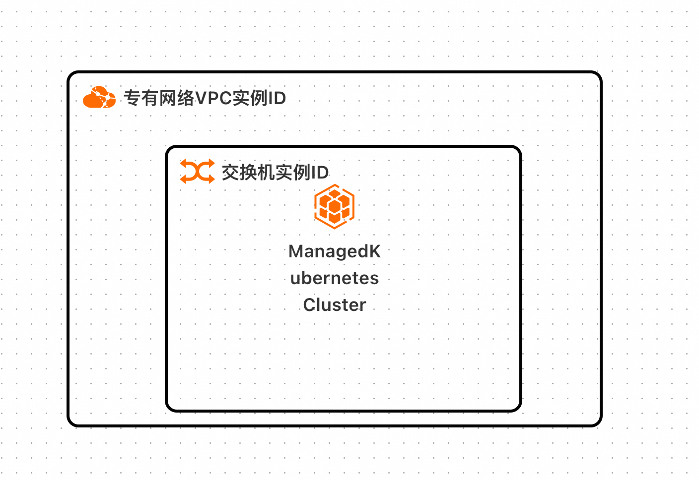
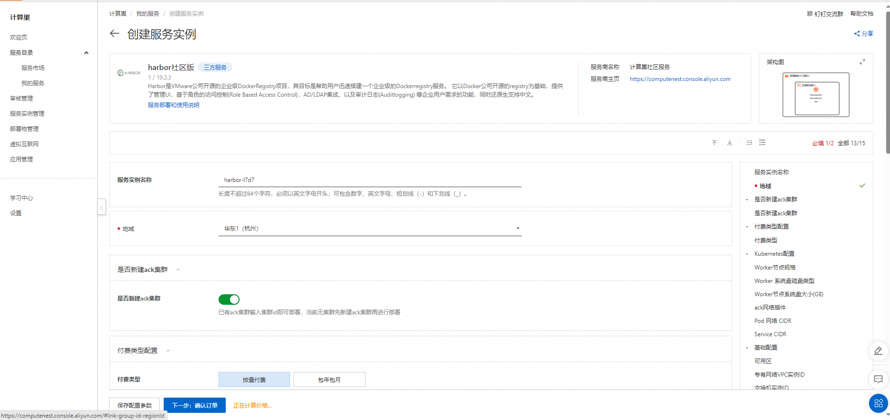
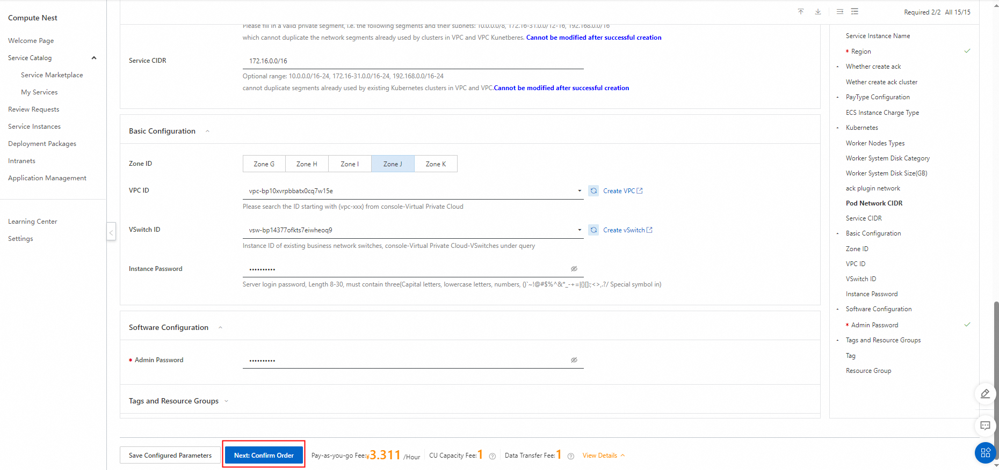
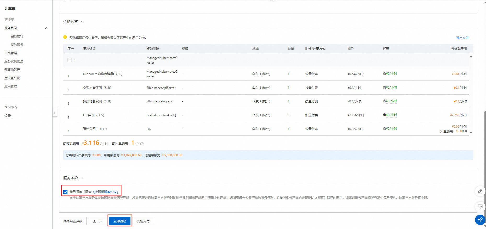
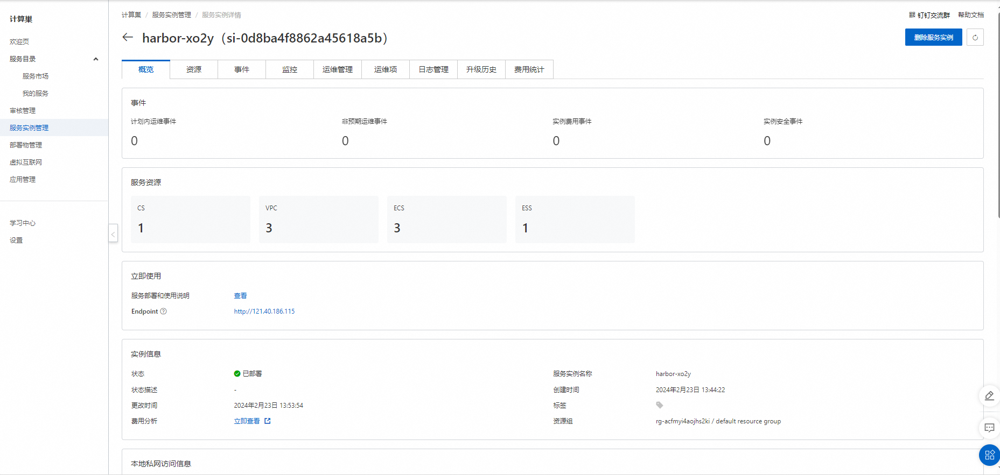
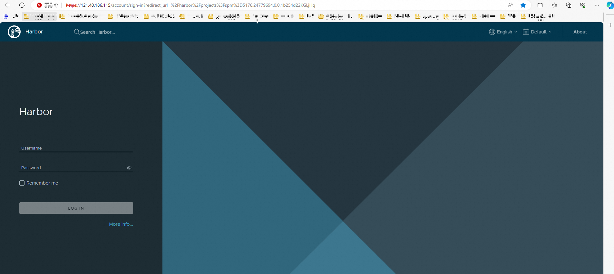

# Harbor Community Edition

>**Disclaimers：**This service is provided by a third party, and we make every effort to ensure its security, accuracy, and reliability, but we cannot guarantee that it is completely free from failures, interruptions, errors, or attacks. Therefore, our company hereby declares that we make no representations, warranties or commitments regarding the content, accuracy, completeness, reliability, applicability, and timeliness of this service, and we are not liable for any direct or indirect losses or damages arising from your use of this service; For the third-party websites, applications, products, and services accessed by you through this service, you are not responsible for their content, accuracy, completeness, reliability, applicability, and timeliness. You shall bear the risks and responsibilities arising from the consequences of use on your own; We are not responsible for any losses or damages arising from your use of this service, including but not limited to direct, indirect, profit, goodwill, data or other economic losses, even if our company has been informed in advance of the possibility of such losses or damages; We reserve the right to modify this statement from time to time, so please regularly check this statement before using this service. If you have any questions or concerns about this statement or this service, please contact us.

## Overview

Harbor is an open-source enterprise level DockerRegistry project by VMware, aimed at helping users quickly build an enterprise level DockerRegistry service. It is based on Docker's open-source registry and provides management UI, Role Based Access Control, AD/LDAP integration, and Auditlogging functions that meet the needs of enterprise users, while also restoring support for Chinese.

## Billing instructions

The expenses on Hmt mainly involve：

- Selected vCPU and memory specifications
- System disk type and capacity
- Public network bandwidth
- Kubernetes and storage space

## Deployment Architecture

## Parameter Description

| Parameter Group            | Parameter item             | illustrate                                                                                                                                           |
|----------------------------|----------------------------|------------------------------------------------------------------------------------------------------------------------------------------------------|
| Service Instance           | Service Instance Name      | The name can be up to 64 characters in length, and can contain digits, letters, hyphens (-), and underscores (_). The name must start with a letter. |
|                            | Region                     | The region where the service instance is deployed.                                                                                                   |
|                            | Instance Charge Type       | Charge type for the service instance.                                                                                                                |
| ECS instance configuration | Instance Type              | ECS instance type                                                                                                                                    |
|                            | Instance Password          | Server login password, Length 8-30, must contain three(Capital letters, lowercase letters, numbers, ()`~!@#$%^&*_-+={}[]:;'<>,.?/ Special symbol in) |
| network configuration      | Availability Zone          | The availability zone where the ECS instance is located                                                                                              |
|                            | VPC ID                     | VPC where resources are located                                                                                                                      |
|                            | VSwitch ID                 | The availability zone of the VSwitch                                                                                                                 |
| Kubernetes configuration   | Worker node specifications | Specification of Worker nodes that can be used in the availability zone                                                                              |
|                            | Worker system disk type    | The type of disk used by the Worker system disk(default cloud_essd)                                                                                  |
|                            | Worker system disk size    | The size of disk used by the Worker system disk(default 120GB)                                                                                       |
|                            | Ack network plugin         | Network plugins required for the ack cluster                                                                                                         |
|                            | Pod network CIDR           | Pod network CIDR                                                                                                                                     |
|                            | Service CIDR               | Service CIDR                                                                                                                                         |

## Permissions required

Deploying this service instance requires accessing and creating some Alibaba Cloud resources. Therefore, your account needs to include permissions for the following resources.
  **Note**：You only need to add this permission when your account is a RAM account.

| Permission policy name            | Remarks                                                                |
|-----------------------------------|------------------------------------------------------------------------|
| AliyunECSFullAccess               | Permission to manage cloud server service (ECS)                        |
| AliyunVPCFullAccess               | Permission to manage private network (VPC)                             |
| AliyunROSFullAccess               | Permission to manage Resource Orchestration Service (ROS)              |
| AliyunComputeNestUserFullAccess   | Manage user-side permissions for the ComputeNest service (ComputeNest) |
| AliyunSLBFullAccess               | Manage permissions for Load Balancing Service (SLB)                    |

## Deployment steps

1.Visit Deployment Link and fill in the deployment parameters as prompted:[Deployment link](https://computenest.console.aliyun.com/service/instance/create/cn-hangzhou?type=user&ServiceId=service-2b7575c1f3d74026aec5)

2.After filling in the deployment link parameters, you can see the corresponding inquiry details. After confirming the parameters, click **Next step: Confirm the order**.

3.After confirming the completion of the order, agree to the service agreement and click **Create Now** to enter the deployment phase.

4.Wait for deployment to complete before entering service instance management.

5.Find Endpoint links in the console and copy them to the browser to access them.

